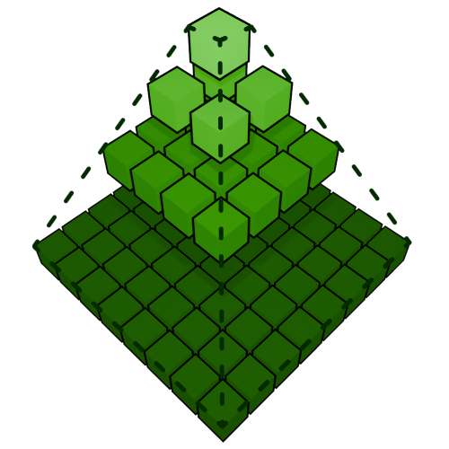

# LDG-SSM: Fast hierarchical grid sorting 

  

The LDG-SSM is a fast hierarchical sorting approach combining the quad-tree structure and objective of the [Level-of-Detail Grid (LDG)](https://doi.org/10.1111/cgf.14537) and the sorting approach of the [Self-Sorting Map (SSM)](https://doi.org/10.1109/TMM.2014.2306183).

Grids sorted using the LDG-SSM can be visualized using the separate [LDG-SSM interface](https://github.com/DavidHidde/ldg-ssm-interface).

## Getting Started
The LDG-SSM is a C++ application that can be compiled natively or using Docker. Most of the dependencies are automatically handled by the CMake project, but some need to be installed manually:

* BZip2
* OpenMP

These dependencies are handled automatically using the Dockerfile. A Makefile is provided for easy environment setup using Docker:

1. `make build-image` Builds the Docker container image. This only has to be run once.
2. `make build-cmake` Builds the CMake project in the folder `app/make-build-default`.
3. `make compile` Compiles the CMake project. The executable is compiled to `app/make-build-default/ldg-ssm`.
4. `make bash` Gives access to a bash interface in the container. You can start the LDG-SSM from here using `make-build-default/ldg-ssm <arguments>`.

Alternatively, the `make build-all` performs all build commands at once.

## Usage
The LDG-SSM supports the use of many CLI arguments to adjust its behaviour. These can be listed using the `--help` argument.

### Input
| Argument   | Description                                     |
|:-----------|:------------------------------------------------|
| `--config` | Path to the config file                         |
| `--input`  | Path to the previous assignment file            |

The program accepts a configuration JSON file that specifies the input data. An [example](data/input/example_data.json) of the format is provided. The input data that is read is assumed to be either a `.raw` file containing a flattened data array file of doubles or a BZip2 compressed `.raw.bz2` variant of this array.
The input assignment is in the format of the original LDG and can be used to initialize the assignment of the method.

### Output
| Argument                      | Description                                                                                                                                              |
|-------------------------------|----------------------------------------------------------------------------------------------------------------------------------------------------------|
| `--output`                    | Path to the output directory. (default: `./`)                                                                                                            |
| `--export`                    | Export the assignment, disparities and data if visualization data is not specified. The export can be used with the LDG-SSM interface. (default: `true`) |
| `--visualization_config`      | Path to the config for the data that visually represents the data model (default: `""`)                                                                  |
| `--log_only`                  | Disable saving the result in any other way than a log.                                                                                                   |
| `--passes_per_checkpoint`     | Number of passes between checkpoints. If bigger than 0, will also log the final result of a pass. (default: `0`)                                         |
| `--iterations_per_checkpoint` | Number of iterations on a height between checkpoints. If bigger than 0, will also log the final result of a height. (default: `0`)                       |                                   |

The output of the LDG-SSM is always nested under a single output directory. Checkpointing per sorting pass/iteration is supported, which creates a nested directory per pass and indicates the iteration in the filename. Using iteration checkpoints also enables checkpointing per height. The final results is always saved in the output directory using a `-final` suffix.
Unless the `log_only` option is specified, the output per checkpoint consists of at most 6 files:

* `<prefix>-config.json`: The main configuration to be loaded by the interface. This config specifies all subfiles that comprise the output.
* `<prefix>-assignment.raw.bz2`: The assignment in LDG format. Can be used as input to the method.
* `<prefix>-disparity.json`: A data configuration file pointing to the disparity data buffer.
* `<prefix>-disparity.raw.bz2`: The flattened disparity data array in LDG-SSM format.
* `<prefix>-visualization-data.json`: A visualization configuration pointing to the raw data buffer. If `visualization_config` is specified, this is not generated.
* `<prefix>-visualization-data.raw.bz2`: A raw data buffer dump from the LDG-SSM. This needs to be post-processed to be visualized. If `visualization_config` is specified, this is not generated.

Post-processing Python files which can be used for the datasets used with the original LDG can be provided upon request.

### Sorting
| Argument                   | Description                                                                                                                                                                        |
|----------------------------|------------------------------------------------------------------------------------------------------------------------------------------------------------------------------------|
| `--passes`                 | Number of passes. (default: `1`)                                                                                                                                                   |
| `--max_iterations`         | Number of maximum iterations for convergence. (default: `100`)                                                                                                                     |
| `--min_distance_change`    | Minimum distance change for convergence. (default: `0.00001`)                                                                                                                      |
| `--seed`                   | Randomization seed. (default: random)                                                                                                                                              |
| `--randomize`              | Randomize the assignment at the start. (default: `true`)                                                                                                                           |
| `--distance_function`      | Distance function to use. Options are: Euclidean distance: `0`, Cosine Similarity: `1` (default: `0`)                                                                              |
| `--ssm_mode`               | Whether the sorting should mimic the Self-Sorting Map (SSM). This changes some parameters like the start sorting height, the target function and cell pairings. (default: `false`) |

The main sorting parameters. Note that the original SSM can be used for sorting using the `ssm_mode` parameter. This does not fully represent the original SSM, but rather a version that is slightly adjusted to use the LDG quad tree properly.

### Misc
| Argument         | Description                                                                                                 |
|------------------|-------------------------------------------------------------------------------------------------------------|
| `--debug`        | Enable debugging (use synthetic data). (default: `false`)                                                   |
| `--rows`         | Number of rows of the grid. (default: `128`)                                                                |
| `--columns`      | Number of columns of the grid. (default: `128`)                                                             |
| `--cores`        | Number of cores to use for parallel. (default: all cores)                                                   |
| `--parent_type`  | Type of parent representation to use. Options are: Normalized average: 0, Minimum child: 1. (default: `0`)  |

A synthetic dataset of uniform RGB values can be used by setting the debug parameters. This dataset is also exported as images, directly visualizing the RGB grid across different heights. The dimension parameters are only used in combination with the RGB dataset.
Additionally, the `--cores` flag can be used to control the number of cores used during operation of the method, which is set to all cores by default. The parent type represents how LDG quad tree parents are calculated, which can be set to `1` for nominal data.

## Compatability
The LDG-SSM is compatible with the [original LDG implementation](https://github.com/freysn/ldg_core) through an adapter interface. The LDG-SSM can translate assignments from and to the format of the original LDG with the difference in measured assignment cost between the two implementations staying within the error margin.

However, the LDG-SSM interface is only compatible with the LDG-SSM output format. To translate an assignment from the original LDG, simply use the LDG assignment as an input assignment for the LDG-SSM, enable exporting and set all sorting parameters to 0. This results in the files required to visualize a LDG assignment in the LDG-SSM interface.

## Project structure
* `app`: All C++ source code and the root of the CMake project. Due to the extensive use of templates, the project almost exclusively consists of header files.
* `data`: The data directory mounted by default by Docker. Input and output data should ideally reside here.
* `scripts`: Some scripts that test the properties of the LDG-SSM. These take the executable as their first argument with the second argument being the output directory. Please check the scripts themselves for scripts specific arguments.

